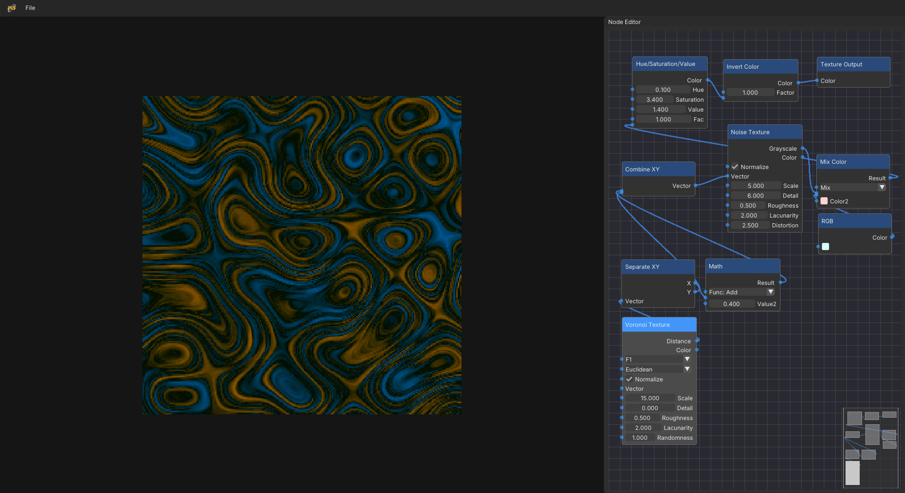

# 🎨 PixelGen Studio (PGS)

**PixelGen Studio** - is a desktop cross-platform (Windows/Linux/macOS)
procedural texture editor with a node-based interface.
The project is focused on flexibility, modularity and extensibility,
allowing the user to create complex textures using nodes.



---

## ✨ Features
- ✅ Node-based editor for procedural texture generation
- ⚡ Real-time rendering of textures as you build
- 🔁 Automatic type conversion between compatible ports
- 🧱 Built-in node types:
  - Generators:
    `Checker Texture`, `Noise Texture`, `Voronoi Texture`, `Gradient Texture`, `Circle`, `Rectangle`
  - Color Manipulation:
    `RGB`, `Mix Color`, `Hue/Saturation/Value`, `Invert Color`
  - Math Nodes:
    `Value`, `Math`, `Mapping`, `Combine XY`, `Separate XY`

---

## 💻 Technologies Used
- **C++20**
- [CMake](https://cmake.org/) - cross-platform build system
- [vcpkg](https://github.com/microsoft/vcpkg) - dependency manager
- [SFML](https://www.sfml-dev.org) - for rendering
- [Dear ImGui](https://github.com/ocornut/imgui) - for UI
- [ImGui-SFML](https://github.com/SFML/imgui-sfml) - for integrating ImGui with SFML
- [ImNodes](https://github.com/Nelarius/imnodes) - for Node Editor UI


## 🏛️ Project Structure
```plaintext
pixel-gen-studio
├───assets                 # Fonts, icons, screenshots, etc.
├───include/PGS
├───src
│   ├───core               # Program logic, managers, buffers
│   ├───gui                # Interface: ImGui + ImNodes
│   └───node_graph         # Node graph backend, nodes
├───third_party
│   ├───imgui
│   ├───imgui-sfml
│   └───imnodes
├───CMakeLists.txt
├───CMakePresets.json
├───LICENSE.txt
├───README.md
└───vcpkg.json
```

---

## 🏗️ Building from Source
### 🔧 Prerequisites
Before building your project, make sure you have everything installed:
- [CMake ≥ 3.21](https://cmake.org/download/)
- [vcpkg](https://github.com/microsoft/vcpkg)
- Compiler with C++20 support:
  - Linux/macOS: GCC or Clang
  - Windows: Visual Studio 2019+ (MSVC) or MinGW

**Note:** If you want to use a MinGW package, you have to use one of the following matching compilers:
[WinLibs UCRT 14.2.0 (32-bit)](https://github.com/brechtsanders/winlibs_mingw/releases/download/14.2.0posix-19.1.1-12.0.0-ucrt-r2/winlibs-i686-posix-dwarf-gcc-14.2.0-mingw-w64ucrt-12.0.0-r2.7z) or
[WinLibs UCRT 14.2.0 (64-bit)](https://github.com/brechtsanders/winlibs_mingw/releases/download/14.2.0posix-19.1.1-12.0.0-ucrt-r2/winlibs-x86_64-posix-seh-gcc-14.2.0-mingw-w64ucrt-12.0.0-r2.7z)

### System Dependencies

Before building, you need to install several system libraries required by SFML and other dependencies.

**On Debian/Ubuntu-based systems:**
```bash
sudo apt-get update
sudo apt-get install build-essential ninja-build pkg-config libx11-dev libxi-dev libxrandr-dev libxcursor-dev libudev-dev libgl1-mesa-dev
```
**On macOS:**
The project is designed to be cross-platform and should be buildable (likely using Homebrew to install dependencies like SFML) on macOS, but it has not been officially tested on this platform.
Users may encounter compilation issues or runtime bugs. Contributions to improve macOS compatibility are highly welcome! If you successfully build the project on macOS, please consider opening a Pull Request with any necessary code changes or updates to these build instructions.

---

PixelGen Studio supports two build workflows:

### Option 1 (Recommended): Build using CMake Presets

This project provides a `CMakePresets.json` file, which makes setup easier and more consistent across platforms.

### ⚙️ Setting `VCPKG_ROOT`
You **must** set `VCPKG_ROOT` so CMake can locate the vcpkg toolchain:

<details> <summary>💻 <strong>Windows (PowerShell)</strong></summary>

```powershell
# Temporary (only current terminal)
$env:VCPKG_ROOT = "C:\path\to\vcpkg"

# Permanent (recommended)
[System.Environment]::SetEnvironmentVariable("VCPKG_ROOT", "C:\path\to\vcpkg", "User")
```
</details>

<details> <summary>🐧 <strong>Linux (bash/zsh)</strong></summary>

```bash
# Temporary (only current terminal)
export VCPKG_ROOT=~/path/to/vcpkg

# Permanent (recommended)
echo 'export VCPKG_ROOT=~/path/to/vcpkg' >> ~/.bashrc
source ~/.bashrc # or restart terminal
```
</details>

<details> <summary>🍎 <strong>macOS (zsh)</strong></summary>

```zsh
# Temporary (only current terminal)
export VCPKG_ROOT=~/path/to/vcpkg

# Permanent (recommended)
echo 'export VCPKG_ROOT=~/path/to/vcpkg' >> ~/.zshrc
source ~/.zshrc
```
</details>

### 🧩 Building with presets
1. **Clone the repository:**
```bash
git clone https://github.com/Capiba0-0/pixel-gen-studio.git

cd pixel-gen-studio
```

2. **Install vcpkg (if needed):**
```bash
git clone https://github.com/microsoft/vcpkg.git
cd vcpkg

./bootstrap-vcpkg.sh        # or .\bootstrap-vcpkg.bat on Windows
```

Then, build using a preset:
<details> <summary>🪟 <strong>Windows (MSVC)</strong></summary>

```bash
# Release & Debug
cmake --preset windows-vs2022
cmake --build --preset windows-vs2022-build
```
</details>

<details> <summary>🛠 <strong>Windows (MinGW)</strong></summary>

```bash
# Release
cmake --preset windows-mingw-r
cmake --build --preset windows-mingw-r-build

# or Debug
cmake --preset windows-mingw-d
cmake --build --preset windows-mingw-d-build
```
</details>

<details> <summary>🐧 <strong>Linux (GCC)</strong></summary>

```bash
# Release
cmake --preset linux-gcc-r
cmake --build --preset linux-gcc-r-build

# or Debug
cmake --preset linux-gcc-d
cmake --build --preset linux-gcc-d-build
```
</details>

<details> <summary>🍎 <strong>macOS (Clang)</strong></summary>

```bash
# Release
cmake --preset macos-clang-r
cmake --build --preset macos-clang-r-build

# or Debug
cmake --preset macos-clang-d
cmake --build --preset macos-clang-d-build
```
</details>

### Option 2: Manual Configuration (without presets)
If you prefer full control or don’t want to use presets, you can configure and build manually using the toolchain and triplet from your desired preset.

Replace `<triplet>` and `<generator>` with values you need, and `<path_to_vcpkg>` with path to your vcpkg.
#### 🧾 Command template:
```bash
cmake -B build -S . \
    -DCMAKE_BUILD_TYPE=<Debug|Release> \
    -DCMAKE_TOOLCHAIN_FILE=<path_to_vcpkg>/scripts/buildsystems/vcpkg.cmake
    -DVCPKG_TARGET_TRIPLET=<triplet> \
    -G "<generator>"

cmake --build build
```

✅ With either approach, vcpkg will automatically download and build dependencies on first configuration — no need to manually run vcpkg install.

---

## 🚀 Quick Start Guide
This guide will walk you through the basic controls and workflow of PixelGen Studio.

### Navigating the Editor
The Node Editor is your main workspace. You can navigate it using the mouse:

-   **Pan:** Click and drag with the **Middle Mouse Button** on any empty space.
-   **Box Select:** Click and drag with the **Left Mouse Button** on any empty space to select multiple nodes.

### Working with Nodes

Nodes are the building blocks of your procedural textures.

-   **Create a Node:** Press **`Shift + A`** or **Right-Click** on an empty space in the editor to open the "Add Node" menu. Select the node you want to create from the list. The new node will appear at your cursor's position.
-   **Move a Node:** Click and drag a node by its **title bar**.
-   **Select a Node:** Simply **Left-Click** on a node. To select multiple nodes, hold **`Ctrl`** while clicking on them, or use Box Select.
-   **Delete Nodes:** Select one or more nodes and press the **`X`** key.

### Working with Connections

Connections (or "links") define the flow of data between nodes.

-   **Create a Connection:** Click and drag with the **Left Mouse Button** from one node's output pin (on the right) to another node's input pin (on the left).
-   **Re-link a Connection:** You can drag an existing connection from one pin to another compatible pin. The old connection will be automatically removed.
-   **Delete a Connection:**
	1. Hold **`Ctrl`** and **Left-Click** on the connection itself.
	2. Or, **Left-Click** to select the connection (it will highlight) and press **`X`**.

### Your First Texture: A Simple Checker Pattern

Let's create something simple to see how it all works together!

1.  **Add an Output Node:** Press `Shift + A` and select `Texture Output`. This node is special; it tells the application what to display on the canvas.
2. **Add a Generator Node:** Press `Shift + A` again and select `Checker Texture`.
3. **Connect Them:** Drag a line from the `Color` output pin of the `Checker Texture` node to the `Color` input pin of the `Texture Output` node.
4. **See the Magic!** You should immediately see a checker pattern appear on the canvas to the left.
5. **Experiment:** Now, try changing the `Scale` value or the colors on the `Checker Texture` node. The canvas will update in real-time with every change you make.

These are the basics to get you started. Now go ahead and experiment by combining different nodes to create your own unique textures

---

## 👤 Author
Made by **Capiba0_0**, a curious developer exploring C++ and programming in general.
PGS is my first project — a playground to better understand graphics, performance, and software architecture.

Started this project while still in school as a way to learn by doing.

🔗 GitHub: [@Capiba0-0](https://github.com/Capiba0-0)
📬 Contact: justcapiba781@gmail.com

---

## 💬 Contact / Feedback
Have feedback or ideas? Feel free to open an issue or contact me!

---

## 📄 License
This project is licensed under the **MIT License** – see the [LICENSE](LICENSE.txt) file for details.

---

## 🤝 Contributing
Contributions are welcome! Please see [CONTRIBUTING.md](CONTRIBUTING.md) for guidelines on how to get started.
